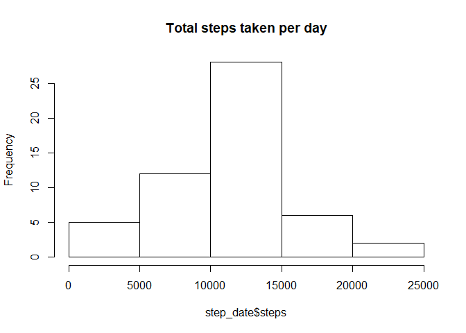
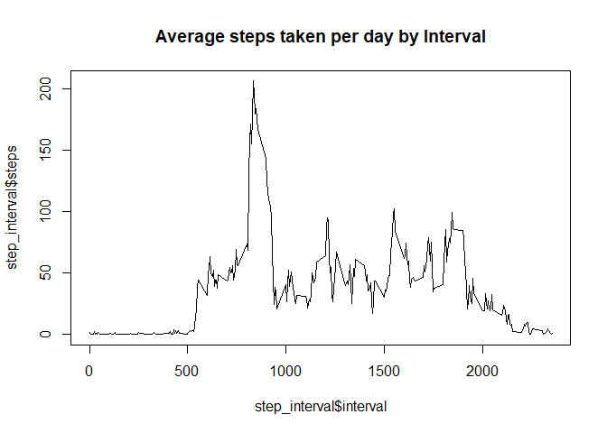
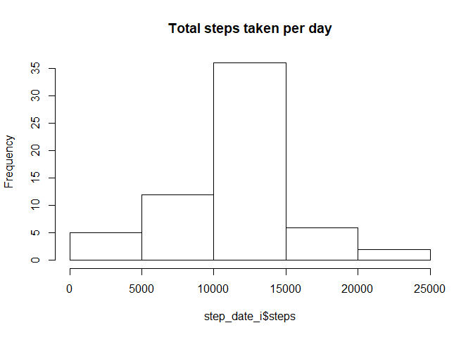
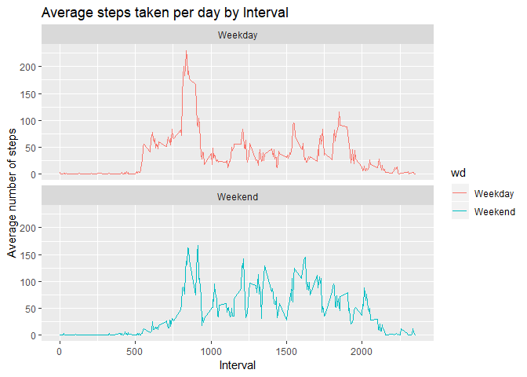

## Loading and preprocessing the data


```r
if (!file.exists("activity.csv")) {
  unzip("activity.zip")
}

data = read.csv("activity.csv")
head(data)
```

```
##   steps       date interval
## 1    NA 2012-10-01        0
## 2    NA 2012-10-01        5
## 3    NA 2012-10-01       10
## 4    NA 2012-10-01       15
## 5    NA 2012-10-01       20
## 6    NA 2012-10-01       25
```


## What is mean total number of steps taken per day?


```r
step_date = aggregate(steps ~ date, data, sum)
hist(step_date$steps, main = "Total steps taken per day")
```

<!-- -->


```
## [1] "Mean: 10766.1886792453"
```

```
## [1] "Median: 10765"
```

## What is the average daily activity pattern?


```r
step_interval = aggregate(steps ~ interval, data, mean)
plot(step_interval$interval,step_interval$steps, type="l",main="Average steps taken per day by Interval")
```

<!-- -->


```
## [1] "The 5-minute interval, on average across all the days in the data set, containing the maximum number of steps is 835"
```


## Imputing missing values
Step 1

```
## [1] "The total number of NA in the dataset is 2304"
```
Step 2&3 : Fill NA with the mean of Interval for that day

```r
imputed_step = step_interval$steps[match(data$interval, step_interval$interval)]
imputed_data = transform(data, steps = ifelse(is.na(data$steps), yes=imputed_step, no=data$steps))
```


```
## [1] "The total number of NA in the dataset is 0"
```
Step 4

```r
step_date_i <- aggregate(steps ~ date, imputed_data, sum)
hist(step_date_i$steps, main = "Total steps taken per day")
```

<!-- -->


```
## [1] "Mean with NA: 10766.1886792453"
```

```
## [1] "Median with NA: 10765"
```

```
## [1] "Mean w/o NA: 10766.1886792453"
```

```
## [1] "Median w/o NA: 10766.1886792453"
```

```
## [1] "Diff. Mean with and w/o NA : 0"
```

```
## [1] "Diff. Median with and w/o NA : -1.1886792452824"
```


## Are there differences in activity patterns between weekdays and weekends?


```r
weekdays = c("Monday", "Tuesday", "Wednesday", "Thursday", "Friday")
imputed_data$wd = as.factor(ifelse(is.element(weekdays(as.Date(imputed_data$date)),weekdays),"Weekday", "Weekend"))
step_interval_i = aggregate(steps ~ interval + wd, imputed_data, mean)
library(ggplot2)
```

```
## Warning: package 'ggplot2' was built under R version 3.5.2
```

```r
ggplot(step_interval_i, aes(x = interval , y = steps, color = wd)) +
       geom_line() +
       labs(title = "Average steps taken per day by Interval", x = "Interval", y = "Average number of steps") +
       facet_wrap(~wd, ncol = 1, nrow=2)
```

<!-- -->
